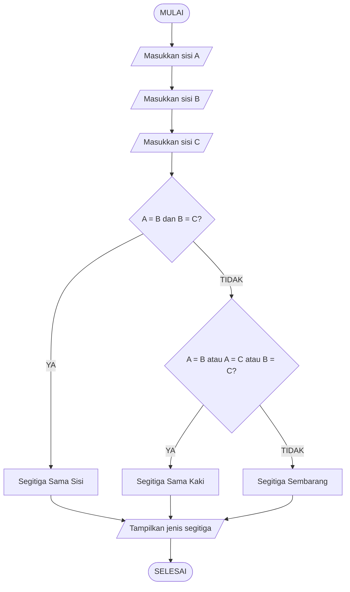

# Keyla Maharani_Alogaritma_Pemograman
Tugas 1 Alogaritma Pemograman

## Menentukan Jenis Segitiga Berdasarkan Panjang Sisinya

## 1. Deskripsi Masalah

Sebuah segitiga memiliki tiga sisi, yaitu **sisi A, sisi B, dan sisi C**. Program ini dibuat untuk menentukan jenis segitiga berdasarkan panjang ketiga sisinya.

Berdasarkan panjang sisinya, segitiga dibedakan menjadi tiga jenis, yaitu:

* **Segitiga Sama Sisi**, jika sisi A, sisi B, dan sisi C memiliki panjang yang sama.
* **Segitiga Sama Kaki**, jika terdapat dua sisi yang memiliki panjang sama.
* **Segitiga Sembarang**, jika ketiga sisi memiliki panjang yang berbeda.

Program akan menerima panjang sisi A, sisi B, dan sisi C sebagai **input**. Selanjutnya, program akan membandingkan ketiga sisi tersebut menggunakan percabangan `if`, `elif`, dan `else`.

Setelah proses perbandingan selesai, program akan menampilkan **jenis segitiga** sesuai dengan panjang sisi yang dimasukkan oleh pengguna.

## 2. Identifikasi Input – Proses – Output (IPO)

| Bagian      | Keterangan                                                                      |
| ----------- | ------------------------------------------------------------------------------- |
| **Input**   | Panjang sisi A, sisi B, dan sisi C                                              |
| **Process** | Membandingkan panjang ketiga sisi untuk menentukan jenis segitiga               |
| **Output**  | Jenis segitiga: Segitiga Sama Sisi, Segitiga Sama Kaki, atau Segitiga Sembarang |

### Alur Sederhana

**Input**

* Masukkan panjang sisi A
* Masukkan panjang sisi B
* Masukkan panjang sisi C

**Process**

* Memeriksa apakah ketiga sisi memiliki panjang yang sama.
* Jika tidak, memeriksa apakah terdapat dua sisi yang memiliki panjang sama.
* Jika tidak ada sisi yang sama, maka segitiga termasuk segitiga sembarang.

**Output**

* Menampilkan jenis segitiga berdasarkan panjang sisi A, B, dan C.

## 3. Pseudocode

### Algoritma Menentukan Jenis Segitiga Berdasarkan Panjang Sisinya

```text
BEGIN

    INPUT sisiA
    INPUT sisiB
    INPUT sisiC

    IF sisiA = sisiB AND sisiB = sisiC THEN
        jenis ← "Segitiga Sama Sisi"

    ELSE IF sisiA = sisiB OR sisiA = sisiC OR sisiB = sisiC THEN
        jenis ← "Segitiga Sama Kaki"

    ELSE
        jenis ← "Segitiga Sembarang"

    END IF

    OUTPUT jenis

END
```

### Penjelasan

1. Program meminta pengguna memasukkan panjang **sisi A**, **sisi B**, dan **sisi C**.
2. Program memeriksa apakah ketiga sisi memiliki panjang yang sama.
3. Jika ketiga sisi sama, maka hasilnya adalah **Segitiga Sama Sisi**.
4. Jika tidak, program memeriksa apakah terdapat dua sisi yang memiliki panjang sama.
5. Jika terdapat dua sisi yang sama, maka hasilnya adalah **Segitiga Sama Kaki**.
6. Jika ketiga sisi berbeda, maka hasilnya adalah **Segitiga Sembarang**.
7. Program menampilkan jenis segitiga sebagai output.

## 4. Test Case 1

### Input

```text
Sisi A = 6 cm
Sisi B = 6 cm
Sisi C = 6 cm
```

### Proses

Karena:

```text
Sisi A = Sisi B
6 = 6

Sisi B = Sisi C
6 = 6
```

Maka ketiga sisi memiliki panjang yang sama.

### Hasil yang Diharapkan

```text
Segitiga Sama Sisi
```

### Tabel Test Case

| Input  |              Nilai |
| ------ | -----------------: |
| Sisi A |               6 cm |
| Sisi B |               6 cm |
| Sisi C |               6 cm |
| Hasil  | Segitiga Sama Sisi |

## 5. Flowchart



## 6. Implementasi Python

Program dibuat menggunakan bahasa pemrograman Python untuk menentukan jenis segitiga berdasarkan panjang sisi A, sisi B, dan sisi C.

```python
# Program Menentukan Jenis Segitiga Berdasarkan Panjang Sisinya

sisi_a = float(input("Masukkan panjang sisi A: "))
sisi_b = float(input("Masukkan panjang sisi B: "))
sisi_c = float(input("Masukkan panjang sisi C: "))

# Proses menentukan jenis segitiga
if sisi_a == sisi_b and sisi_b == sisi_c:
    jenis = "Segitiga Sama Sisi"

elif sisi_a == sisi_b or sisi_a == sisi_c or sisi_b == sisi_c:
    jenis = "Segitiga Sama Kaki"

else:
    jenis = "Segitiga Sembarang"

# Output
print("Jenis segitiga:", jenis)
```

## 7. Hasil Pengujian

### Pengujian 1
Input:
- Sisi A = 6
- Sisi B = 6
- Sisi C = 6

Output:
```text
Jenis segitiga: Segitiga Sama Sisi

## 8. Hasil Pengujian

### Pengujian Segitiga Sama Sisi

**Input:**
- Sisi A = 6
- Sisi B = 6
- Sisi C = 6

**Output:**

```text
Jenis segitiga: Segitiga Sama Sisi
```

Hasil pengujian menunjukkan bahwa ketika sisi A, sisi B, dan sisi C memiliki panjang yang sama, program menghasilkan **Segitiga Sama Sisi**.
